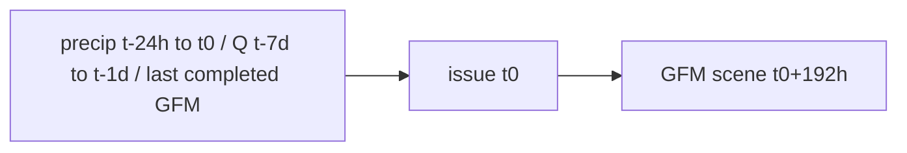

# Phase 5.5 — Spatial AI validation audit

Do **not** read this as a promotion to VALIDATED. The extract is a leakage-safe proof-of-concept.

## 1. Current model (inspected)

| Item | Value |
| --- | --- |
| Input channels (8) | precip 24 h (broadcast), precip 72 h (broadcast), log1p Q (broadcast), month sin/cos, persistence map, persistence-valid flag, `precip_is_aoi_point` flag |
| Label | GFM ensemble extent, OBSERVED. Coarse cell flood if valid fraction ≥ 0.25. 255 unknown, **never dry** |
| Target horizon | **192 h** (issue = scene time − 8 days). Product 6/12/24/48/72 h **UNAVAILABLE** |
| Working grid | 32×32 on city bounds; native GFM 20 m Equi7 **E039N021T3** |
| Splits | Temporal: train ≤2018, val 2019–2021, test 2022+ / named holdout. No pixel-i.i.d. Geographic: train Dhaka, test Sunamganj/Sylhet |
| Geography | Dhaka + Sunamganj. Sylhet: insufficient valid coverage |

## 2. Independent events

Adjacent GFM orbit pairs (e.g. 16 May and 18 May 2022) are **one** meteorological episode.

Independence rule used for the validation floor: episodes separated by **&gt;45 days** (orbit twins *and* intra-monsoon revisits). Two city tiles on the same flood are one event.

| Count | Value |
| --- | --- |
| Unique flood events | **7** (`2018-01`, `2018-06`, `2019`, `2020`, `2021`, `2022`, `2023`) |
| Unique dates | **39** |
| Unique regions | **2** (Dhaka, Sunamganj) |
| Unique tiles | **63** |
| Positive-pixel prevalence (valid cells) | ≈ 5.5% |
| Negative-pixel prevalence (valid cells) | ≈ 94.5% |
| Unknown-pixel percentage (all cells) | ≈ 60% |

Validation floor: **20** independent events. **INSUFFICIENT FOR VALIDATION.** The catalog is not promoted.

## 3. Dataset expansion

STAC was searched for 2016–2024 monsoon/dry windows on the union AOI bbox. Neighbor Equi7 tile `E039N024T3` hits were rejected. Many scenes are nodata over the AOI (STAC geometry is the tile, not the swath) and stay **unknown**.

The index is rebuilt from **all local product-tile GeoTIFFs with ≥5% valid AOI**, not from a 21-day STAC subsample that landed on empty swaths. That grew the extract from 17 days / 27 tiles to **39 days / 63 tiles** without inventing extra events: still **7** meteorological episodes.

2016, 2017, and 2024 windows did not yield AOI-valid maps in this pull.

## 4. Geographic coverage

**Defensible scope:** Bangladesh northeast/central floodplain AOIs already in the product (Dhaka, Sunamganj, Sylhet when covered).

| Region | In this extract? | Recommendation |
| --- | --- | --- |
| Dhaka | Yes | Keep |
| Sunamganj | Yes | Keep (geographic holdout) |
| Sylhet | No (valid fraction &lt; 5%) | Keep trying; do not impute |
| Other Bangladesh | No | Optional later if on E039N021T3 |
| Other South Asia | No | New Equi7 tiles + new data card |
| Global flood regions | No | Out of scope for v0.1 |

Do **not** claim global (or even South Asian) generalization from this Bangladesh-only extract.

## 5. Flood label quality

For every indexed scene the builder records valid / flood / dry / unknown pixel counts. Scenes below 5% valid AOI are dropped. Remaining 255 is unknown in loss and metrics. **Nodata is never converted to dry.**

Labels are the GFM scene at `valid_at`. Features stop at `t0 = valid_at − 192 h`.

## 6–7. Horizons and temporal alignment

GFM is Sentinel-1 scene-based (typical revisit 6–12 days). There is **no** observed flood raster at t0+6 h, +12 h, +24 h, +48 h, or +72 h. Those labels are not invented.

**Supported product horizon: 192 h only.** 24 h is **not** the first validated spatial target, because 24 h labels do not exist. A 24→48→72 h ladder requires daily (or better) observed maps, which GFM does not provide.

Nothing after t0 is used as a feature. Same-time SAR is the **label only**. Persistence is the previous **completed** map (`valid_at` before t0).

## 8. Broadcast rain / Q

Six of eight U-Net channels are spatially constant on the 32×32 tile. Only lagged inundation (and its valid flag) vary in space.

That is **spatial information loss**: the network cannot learn “it rained on the haor but not on the city” from these channels. It is acceptable for a leakage-safe PoC. It is **not** a 500 m rainfall field.

Cheap next step (not implemented): a small Open-Meteo point lattice (4–9 points) interpolated onto the tile. Radar/NWP cubes are not justified at n=7 events.

## 9. DEM

`FLOODLENS_DEM_PATH` is unset. `try_load_city_dem` fails closed. Synthetic DEM remains pipeline-test only.

Ingestion plan if an operator supplies a real GeoTIFF: `terrain_service.get_window` onto the 32×32 AOI; nearest-neighbor resize; never invent elevations. Candidate public DEMs: Copernicus GLO-30 / FABDEM / SRTM (license check before redistribution). Terrain is first-order for flood location; missing DEM is a structural limitation.

## 10–16. Evaluation protocol

Same held-out events for: persistence, rainfall threshold, pixel logistic, pixel GBDT, 3×3 conv-smooth, Tiny U-Net.

Metrics emphasize IoU, Dice, recall, AUPRC. Event-level mean/median/std + worst map. Geographic retrain on Dhaka only. Temporal holdout by issue year. Hard-case subsets. Conformal empirical coverage; uncertainty–error rank correlation. **`claim_80_percent` is always false unless measured.**

Numbers from `scripts/phase55_evaluate.py` (dataset `phase55-gfm-aoi-v0.2`). **Accuracy is not reported.** Unknown pixels are dropped.

| Model (test pixels, n=7926) | IoU/CSI | AUPRC | Recall @ 0.5 |
| --- | --- | --- | --- |
| Persistence | 0.128 | 0.290 | 0.226 |
| Rainfall threshold | 0.121 | 0.207 | 0.824 |
| Pixel logistic | 0.110 | 0.248 | 0.828 |
| Pixel GBDT | **0.231** | **0.359** | 0.795 |
| 3×3 conv-smooth | 0.108 | 0.200 | 0.184 |
| Tiny U-Net | 0.026 | 0.086 | 0.057 |

U-Net event-level test IoU: mean 0.009, median 0, std 0.020. Worst map: 2022-05-16 Dhaka, IoU 0.

Geographic retrain (Dhaka → Sunamganj) IoU mean 0. Persistence/GBDT beat the U-Net. That is a reason **not** to promote, not a reason to hide the baseline table.

U-Net BCE: train 0.985, val 0.679, test 0.681 (train curve did not decrease usefully).

Conformal: target 0.80, empirical **0.69**, mean interval width 0.99, `claim_80_percent=false`. Uncertainty–error rank correlation **−0.04** (not informative). Do not present the uncertainty map as confidence.

## 18–21. Status

- Spatial public catalog: **NOT_TRAINED** (display: **TRAINED — NOT VALIDATED** if a checkpoint exists)
- `POST /api/v1/forecast/ai-spatial`: **UNAVAILABLE** / `catalog_status=NOT_VALIDATED`
- Physics: **COMPARISON NOT YET COMPARABLE**

To make physics comparable later: hours-to-days hydrodynamic run (or GloFAS Rapid Flood Mapping lookup) on the **same** horizon and grid as GFM. The 0.5 s SWE burst is not that product.

## 24. Dataset growth decision

**OPTION A.** Limited proof-of-concept only.

Not OPTION B yet: 7 independent events is far from a 20-event validation floor. Expanding to N≈20 would mean additional **years and/or Equi7 tiles**, not denser 2-day twins of the same monsoon.

Not OPTION C: the 192 h GFM occurrence task is a real, leakage-safe task. The product vision’s 6/12/24 h maps are unavailable; they stay UNAVAILABLE rather than replacing the 192 h task with invented labels.

## 25. Compute (this extract)

| Item | Estimate |
| --- | --- |
| GFM raw (local product tile) | ~33 MB (cap 200 MB; plan ceiling 8 GB) |
| Processed tiles | 63 × 32×32 npz, ≪ 10 MB |
| Checkpoint | ~0.3 MB |
| Training | CPU minutes, no GPU required for 32×32 Tiny U-Net |
| GPU RAM | Not required |
| CPU RAM | &lt; 2 GB typical |

## Solver

`src/floodlens/numerical/**` unmodified.
